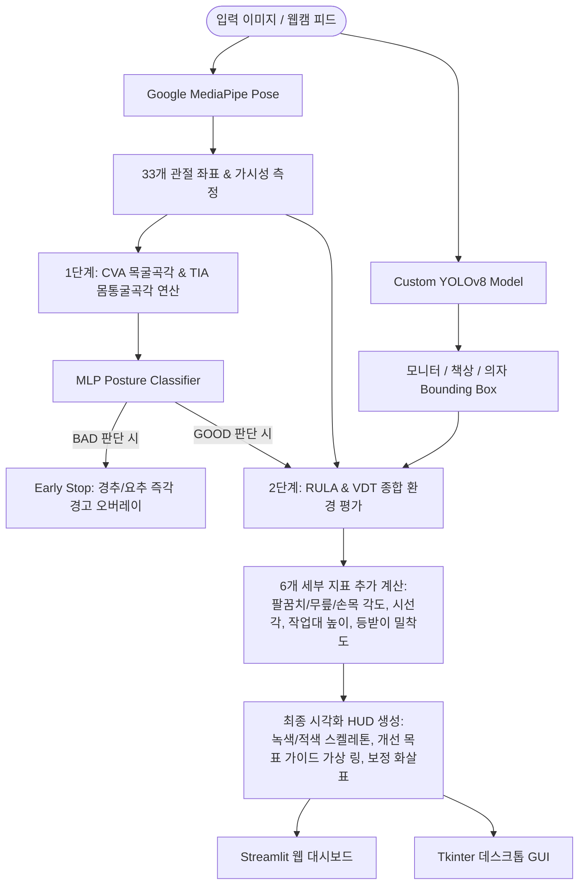

# 🧘 Fit Me Up (자세히봐) — AI 자세 및 작업 환경 통합 분석 시스템

> **컴퓨터 비전(Computer Vision) 기술을 활용하여 사용자의 실시간 신체 자세와 주변 작업 환경(의자, 책상, 모니터)을 통합 분석하고, VDT 및 RULA 기준에 부합하는 개인 맞춤형 자세 교정 피드백을 제공하는 프리미엄 포트폴리오 프로젝트입니다.**

---

## 🛠 Tech Stack (기술 스택)

<p align="left">
  
  
  
  
  
  
  
  
</p>

---

## 💡 프로젝트 개요 (Project Overview)

현대 직장인과 학생들의 고질병인 근골격계 질환(거북목증후군, 척추측만증 등)은 단순히 **"신체 자세"**뿐만 아니라 모니터 높이, 책상 높이, 의자 밀착도 등 **"작업 환경(Ergonomic Environment)"**과의 관계에서 비롯됩니다.

**Fit Me Up (자세히봐)**은 이러한 한계를 극복하기 위해 다음 두 가지 핵심 AI 기술을 융합합니다:
1. **MediaPipe Pose**: 사용자의 주요 신체 관절 랜드마크(33개 좌표) 추출 및 실시간 각도 연산
2. **Custom YOLOv8**: 사무실 환경 객체(모니터, 책상, 의자) 탐지 및 공간 좌표 획득

이 두 모델의 출력을 결합하여 **총 8가지 핵심 VDT/RULA 표준 지표**를 실시간으로 평가하고, 실물 크기 오버레이와 인터랙티브 시각화를 통해 직관적인 피드백을 제시합니다.

---

## ⚙️ 시스템 아키텍처 (System Architecture)



---

## 📊 8가지 핵심 진단 지표 (Diagnostic Metrics)

본 프로젝트는 고용노동부 VDT 증후군 예방지침 및 RULA(Rapid Upper Limb Assessment) 평가 시스템을 기반으로 **8대 정밀 자세 및 환경 지표**를 정의하여 정밀 측정합니다.

| 번호 | 지표명 | 측정 방식 | 정상 기준 범위 | 교정 제안 가이드 |
|:---:|---|---|---|---|
| **01** | **CVA 목굴곡각** | 귀(Tragus)와 어깨(Acromion) 연결선의 연직각 | 0° ~ 20° | 모니터 상단을 눈높이로 조절, 거북목 의심 |
| **02** | **TIA 몸통굴곡각** | 어깨와 골반(Hip) 연결선의 연직각 | 0° ~ 10° | 골반을 의자 뒤쪽까지 완전히 밀착 |
| **03** | **팔꿈치 각도** | 어깨-팔꿈치-손목 관절 내각 | 90° ~ 120° | 팔꿈치와 책상이 수평이 되도록 의자 높이 조절 |
| **04** | **무릎 각도** | 골반-무릎-발목 관절 내각 | 85° ~ 100° | 무릎이 90° 전후가 되도록 조절, 발받침대 권장 |
| **05** | **손목 각도** | 팔꿈치-손목-손가락MCP 각도의 수평 편차 | ±15° 이내 | 키보드 앞 15cm 공간 확보 및 손목받침대 사용 |
| **06** | **모니터 시선각** | 눈과 모니터 중심점 연결선이 이루는 하방각 | 10° ~ 15° | 모니터 상단과 눈높이 일치, 화면 거리 40cm 이상 |
| **07** | **작업대 높이** | 팔꿈치 y좌표 대비 책상 상판 y좌표 편차 | ±10% 이내 | 책상 높이 조정 혹은 의자 높이를 통한 팔꿈치 정렬 |
| **08** | **의자 등받이** | 골반 x좌표와 의자 등받이 끝단의 상대 거리 | 골반폭 20% 이내 | 등받이에 요추가 밀착되도록 지지 쿠션 사용 권장 |

### 🛑 지능형 2단계 의사결정 파이프라인 (Early Stop)
- **1단계 (경추 & 요추 보호)**: 코어 지표인 **CVA**와 **TIA**를 기준으로 자체 학습된 **MLP 자세 분류 모델**(`posture_mlp_final.keras`)이 1차 판정을 내립니다. 두 지표 중 하나라도 비정상(`BAD`) 범주에 속하면, **불필요한 연산을 방지하기 위해 파이프라인을 조기 종료(Early Stop)**하고 척추 중심선에 즉시 빨간색 경고 오버레이와 자세 교정 화살표를 표시합니다.
- **2단계 (종합 환경 진단)**: 1단계 코어 자세가 양호할 경우에 한하여 2단계 정밀 분석을 활성화합니다. YOLO가 감지한 가구(책상, 의자, 모니터)와의 공간 관계 및 사지 각도 6종을 추가 연산하여 정밀 HUD 및 세부 교정 가이드를 실시간으로 매핑합니다.

---

## 🎨 주요 사용자 인터페이스 (User Interfaces)

### 1️⃣ 프리미엄 Streamlit 웹 대시보드 (`app.py`)
- **디자인 혁신**: 기존의 획일화된 Streamlit 레이아웃에서 벗어나 고품격 모던 CSS 커스터마이징을 적용하였습니다. (Pretendard 폰트 패밀리, HSL 커스텀 테마 컬러, Glassmorphism 형태의 입체적인 피드백 카드 제공).
- **사용자 관리**: 로컬 파일 시스템(`users.json`)과 SHA-256 단방향 솔트 비밀번호 해싱을 활용한 안전한 **자체 로그인 및 회원가입** 기능 탑재.
- **히스토리 트래킹**: 이전의 자세 측정 결과를 누적 저장(`user_history.json`)하고 **Altair 기반의 인터랙티브 시각화 차트**를 통해 일별 자세 점수 추이 변화 분석 및 피드백 기록 제공.
- **로고 자동 알파채널 처리**: `logo.png` 로드 시 흰색 배경을 투명하게 변환(`logo_transparent.png`)하여 다양한 백그라운드 색상에 대응.

### 2️⃣ 데스크톱 전용 오프라인 GUI (`integrate.py`)
- **초고속 추론**: Tkinter 프레임워크 기반으로 구현되어 가볍고 독립적인 데스크톱 애플리케이션으로 실행 가능.
- **오버레이 렌더링**: 분석된 신체 프레임에 현재 관절각과 정상 가상 링(Target Guide Ring)을 결합하여 실시간으로 이상적인 위치를 안내하는 가이드라인 렌더링.
- **정밀 피드백**: 직관적인 체크리스트 패널 및 RULA/VDT 기준 위반 여부에 따른 컬러 코딩된 UI 컴포넌트 탑재.

---

## 📂 프로젝트 구조 (Directory Structure)

```text
Fit_me_up/
├── MediaPipe/                # 자세 분석 모듈 (Postural Analysis)
│   ├── code/                 # 추론 API, 테스트 UI, 학습 스크립트
│   ├── models/               # CNN(MobileNetV2), MLP 모델 파일
│   └── data/                 # 학습용 관절 좌표 데이터셋
├── YOLO/                     # 환경 탐지 모듈 (Environment Detection)
│   ├── YOLO_full_body_Labeling/   # 전신 이미지 데이터셋
│   ├── YOLO_ankle_visible_Labeling/# 발목 노출 데이터셋
│   ├── fit_me_up/            # custom 학습 가중치 저장소
│   │   └── combined_gpu/
│   │       └── weights/
│   │           └── best.pt   # ← [핵심 가중치] 학습된 YOLOv8 모델 가중치
│   ├── run_all.py            # YOLO 자동 학습 스크립트
│   └── yolo_test.py          # YOLO 추론 테스트 모듈
├── app.py                    # Streamlit 기반 통합 웹 서비스 엔트리포인트 (Web Server)
├── integrate.py              # Tkinter 기반 로컬 분석 프로그램 엔트리포인트 (Desktop Client)
├── requirements.txt          # 프로젝트 공통 가상환경 의존성 패키지 리스트
├── users.json                # 사용자 인증 로컬 데이터베이스
└── user_history.json         # 분석 점수 누적 데이터베이스
```

---

## 🚀 빠른 시작 (Quick Start)

본 프로젝트는 별도의 YOLO 모델 학습 단계를 거치지 않더라도 내장된 학습된 가중치 모델(`best.pt`)을 사용해 즉시 테스트할 수 있도록 설계되었습니다.

### 1. 가상환경 구성 및 패키지 설치
Windows 환경 및 NVIDIA CUDA GPU 지원 라이브러리(cu121)가 탑재된 요구사항 설치 가이드입니다:

```bash
# 1. 저장소 클론
git clone https://github.com/areum-mong/Fitme-up.git
cd Fitme-up

# 2. 가상환경 생성 및 활성화
py -3.11 -m venv .venv
source .venv/Scripts/activate # Git Bash 환경
# 또는 Windows PowerShell: .venv\Scripts\Activate.ps1

# 3. 요구사항 한 번에 설치 (PyTorch CUDA 지원 인덱스 포함)
pip install -r requirements.txt
```

### 2. Streamlit 웹 애플리케이션 실행
```bash
streamlit run app.py
```
- 브라우저 창에서 `http://localhost:8501` 주소로 자동으로 연결됩니다.
- 회원가입 후 로그인을 진행하시면 전체 피드백 및 트래킹 서비스를 이용하실 수 있습니다.

### 3. 데스크톱 Tkinter 통합 분석기 실행
```bash
python integrate.py
```
- 화면 좌측에서 분석하고자 하는 측면 상반신/전신 이미지를 로드하고 **"분석 시작"** 버튼을 눌러 통합 피드백을 실시간으로 확인해 보세요.